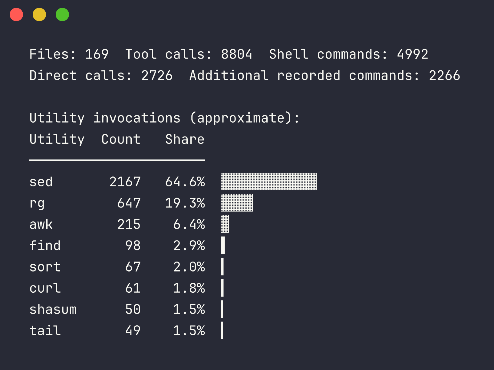

<div align="center">

# 🔎 Shellscope

**See which shell tools Codex calls—and inspect the exact commands.**

</div>

Built from Codex source and synthetic fixtures, without inspecting your private
transcripts.

Point this read-only Python CLI at completed Codex sessions to rank shell
utilities and trace each count back to its original call. It runs locally with
only the standard library.

Scanning my Codex sessions on my Mac, with a few utilities hidden:



## How it works

List the matching filenames:

```sh
find ~/.codex/sessions -type f -name 'rollout-*.jsonl' -print
```

Once you've reviewed the list, scan the matching files:

```sh
find ~/.codex/sessions \
  -type f -name 'rollout-*.jsonl' -print0 |
  python3 observer.py --sessions-from - --min-count 40
```

`-print0` separates filenames safely; the final `-` tells the observer to read
that list from stdin.

For a cleaner ranking, copy the example exclusion list and edit it:

```sh
cp excluded.example.txt excluded.txt
```

Then scan with the file:

```sh
find ~/.codex/sessions \
  -type f -name 'rollout-*.jsonl' -print0 |
  python3 observer.py --sessions-from - --min-count 40 \
    --exclude-file excluded.txt
```

## Notes

Source references are pinned to [openai/codex@8d32abcd](https://github.com/openai/codex/commit/8d32abcd017d06511b46050cff9dbba8738fc2fa). The nearby [0.153.0-alpha.6 release](https://github.com/openai/codex/releases/tag/rust-v0.153.0-alpha.6) provides version context; it is not the exact source revision.

- Hook contract: [PreToolUse schema](https://github.com/openai/codex/blob/8d32abcd017d06511b46050cff9dbba8738fc2fa/codex-rs/hooks/schema/generated/pre-tool-use.command.input.schema.json) and [serialization tests](https://github.com/openai/codex/blob/8d32abcd017d06511b46050cff9dbba8738fc2fa/codex-rs/hooks/src/events/pre_tool_use.rs).
- Rollout format: [envelope](https://github.com/openai/codex/blob/8d32abcd017d06511b46050cff9dbba8738fc2fa/codex-rs/history/src/rollout_payload.rs) and [response item types](https://github.com/openai/codex/blob/8d32abcd017d06511b46050cff9dbba8738fc2fa/codex-rs/protocol/src/models.rs).
- Saved commands: [command item](https://github.com/openai/codex/blob/8d32abcd017d06511b46050cff9dbba8738fc2fa/codex-rs/protocol/src/items.rs) and [rollout persistence policy](https://github.com/openai/codex/blob/8d32abcd017d06511b46050cff9dbba8738fc2fa/codex-rs/rollout/src/policy.rs).
- Command mapping: [handler](https://github.com/openai/codex/blob/8d32abcd017d06511b46050cff9dbba8738fc2fa/codex-rs/core/src/tools/handlers/unified_exec/exec_command.rs) and [tests](https://github.com/openai/codex/blob/8d32abcd017d06511b46050cff9dbba8738fc2fa/codex-rs/core/src/tools/handlers/unified_exec_tests.rs).


## Future work

- Document the Codex rollout formats this parser supports and flag unverified
  newer formats. Future format changes may require parser updates.

## Synthetic tests

Run the synthetic tests with `python3 -m unittest discover -s tests -v`.

You can also try the included synthetic session without opening a private one:

```sh
python3 observer.py tests/fixtures/synthetic-rollout.jsonl
python3 observer.py tests/fixtures/synthetic-rollout.jsonl --format calls
```

## FAQ

**Does Shellscope help me do something I can't do elsewhere?**

Not uniquely. Other projects analyze agent sessions too.

**Have I checked other projects' code, tests, and privacy behavior?**

Not yet. I've read enough to understand what they offer, not enough to
recommend them. For context:

- [TraceLab](https://tracelab.cs.washington.edu/exp/tool_calls/bash_command_breakdown/) ranks executables across Codex and Claude traces with deeper Bash parsing.
- [codex-logger](https://github.com/kkrlstrm/codex-logger) puts local Codex tool calls into a queryable database.
- [cxstat](https://github.com/takeshiD/cxstat) reports tool and token usage, with deeper shell-command analysis on its roadmap.

Shellscope stays narrower: choose local sessions, get a quick ranking, and
inspect the calls behind it.

## Caveats

These are rough counts of attempted utility invocations: unusual shell syntax,
scripts, and code-mode calls may be missed or misread, and copied session history
can repeat calls across files.
